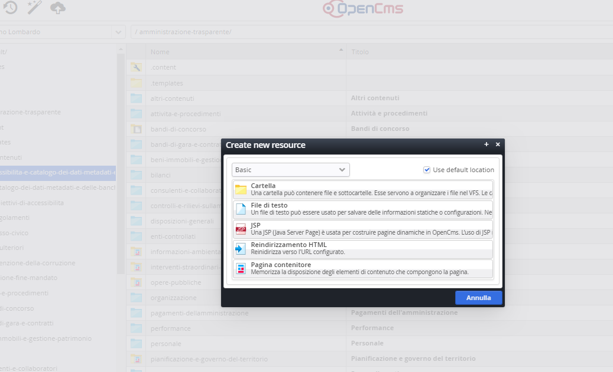
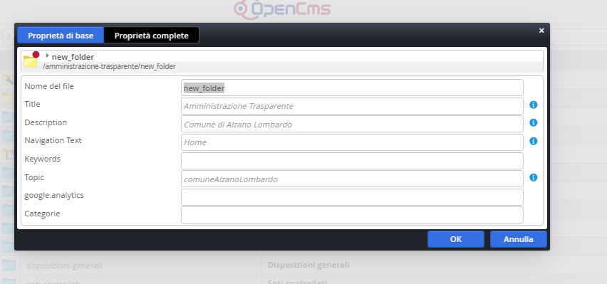

Creazione nuova cartella per i documenti
========================================

In caso si dovesse creare una nuova cartella di documenti, che non è presente tra quelle esistenti, posizionarsi nel punto dell’alberatura dove si intende creare una nuova cartella, cliccare sul simbolo della bacchetta magica nel menu in alto a sinistra. 

\ |IMG45|\ 

Facendo doppio click sulla la cartella, si apre a sua volta la seguente finestra:

\ |IMG46|\ 

Questa finestra permette di nominare la cartella, compilando il nome del file e il titolo della cartella con un nome significativo e parlante. Ora che la cartella è pronta va popolata dei relativi file come viene spiegato nella sezione:  \ |STYLE141|\ 

Impostazioni ulteriori
----------------------

Un’ ulteriore operazione di settaggio, da page editor, è quella per decidere il tipo di ordinamento dei file caricati.

Posizionandosi  nella pagina di contenuti con il mouse sul simbolo del mirino, viene visualizzato il simbolo dell’Ingranaggio “\ |STYLE142|\ ”,  da cui si può settare  l’ordine di apparizione dei documenti  che può essere selezionato tra quelli presenti:

* ultima data di modifica/pubblicazione (opzione di defautl)

* titolo

* nome del file

* titolo

* data di creazione

.. |STYLE141| replace:: **Caricamento nuovi documenti.**

.. |STYLE142| replace:: **impostazioni elemento**

