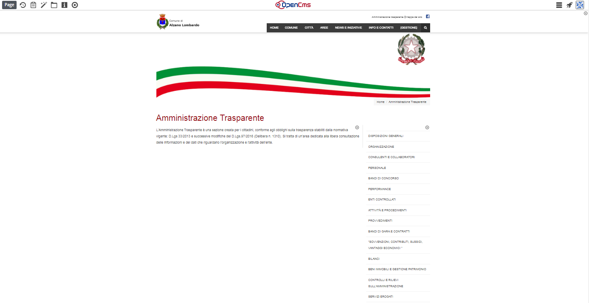
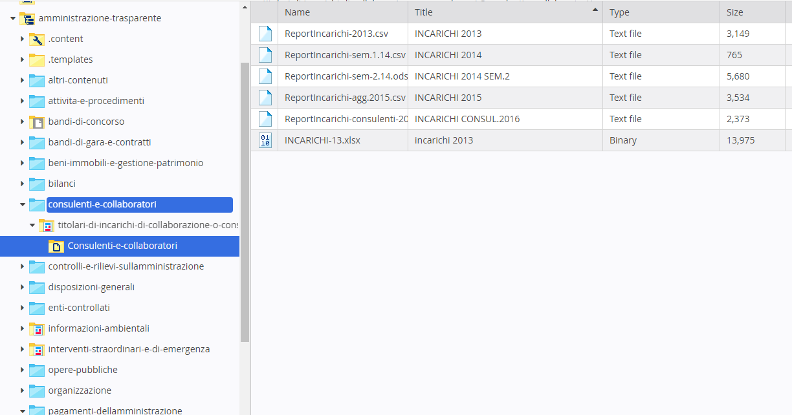

Amministrazione Trasparente
***************************

\ |IMG36|\ 

L’Amministrazione Trasparente costituisce una sezione a parte rispetto al resto del sito. 

Si tratta infatti di un ”mini sito” con le sue caratteristiche e regole peculiari.

In particolare, il \ |STYLE136|\  degli allegati alle varie sezioni, va effettuato esclusivamente da \ |STYLE137|\  nelle cartelle specifiche di Amministrazione Trasparente e \ |STYLE138|\  in gallery come tutti gli altri allegati.

\ |IMG37|\   

La prima voce:  \ |STYLE139|\ compare per prima perché le cartelle,  in gestione, seguono l’ordinamento alfabetico, mentre nell’alberatura ufficiale Altri contenuti è l’ultima voce.

La prima cosa da fare è posizionarsi nella cartella esistente dell’alberatura dove si intende caricare la documentazione: il caricamento può essere effettuato in 2 modalità:

#. Dal menu in alto, selezionare Upload. \ |IMG38|\  Una finestra permetterà di selezionare e caricare dei files direttamente dal proprio pc. >> dopo aver dato ok, la finestra successiva permette di nominare e dare una descrizione al file>>Finish. A questo punto il file è caricato. La stessa operazione è valida anche trascinando e caricando diversi files.

#. trascinare fisicamente uno o più documenti  dal proprio pc  nella cartella di Explorer corrispondente.

.. toctree::
    :maxdepth: 2
    
    modifica contenuti pagina e aggiunta nuove sezioni di documenti.rst
    creazione nuova cartella per i documenti.rst

   
.. |IMG38| image:: immagini/Manuale_utente_sitoweb_10_5_7_34.png
   :height: 38 px
   :width: 37 px
   
.. |STYLE136| replace:: **caricamento**

.. |STYLE137| replace:: **Explorer**

.. |STYLE138| replace:: **non**

.. |STYLE139| replace:: **“Altri contenuti “**
