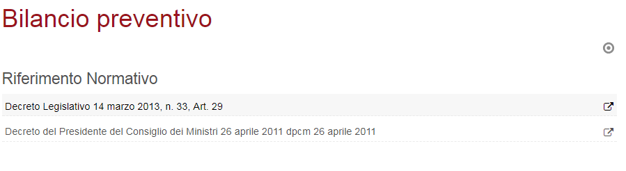
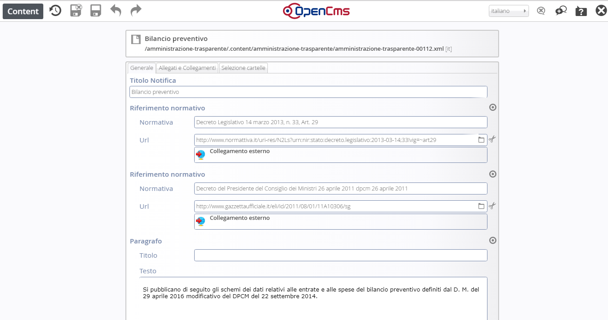
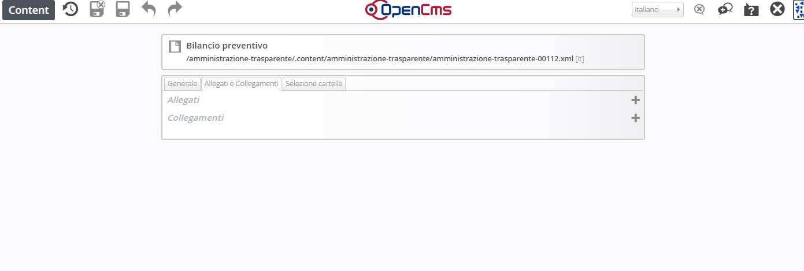
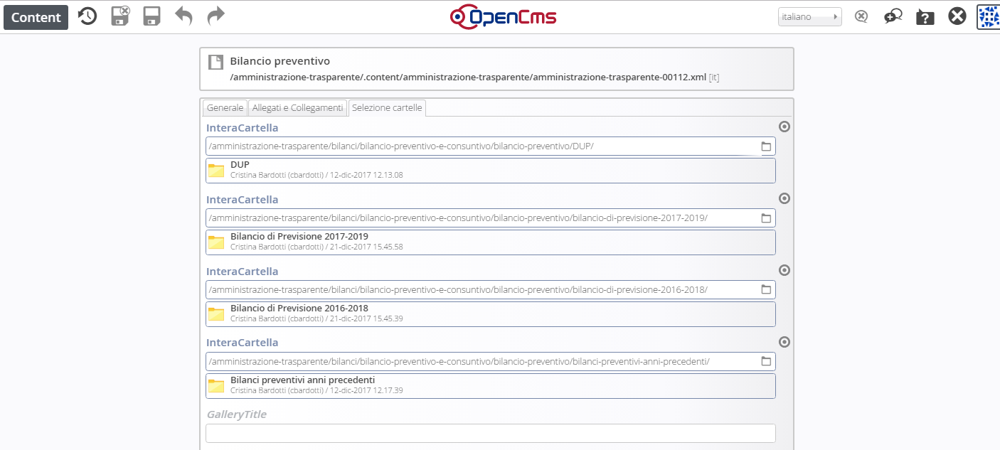
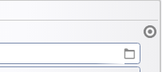
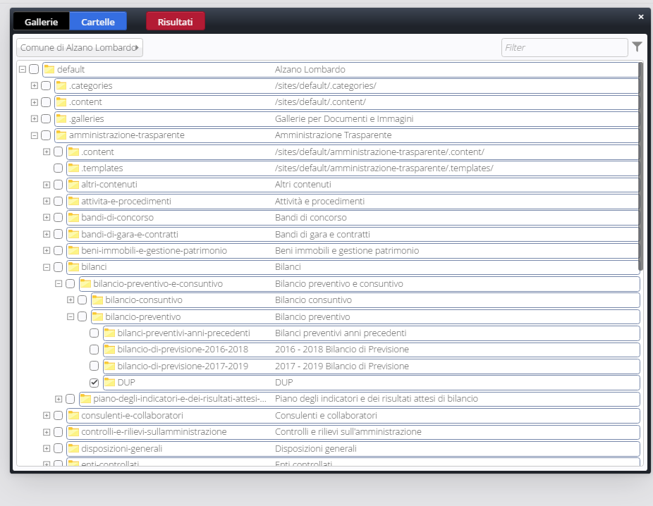

Modifica contenuti pagina e aggiunta nuove sezioni di documenti
===============================================================

Dopo aver caricato gli allegati, per poter visualizzare la cartella di documenti nella pagina, procedere in questo modo:

Da Explorer posizionarsi su Page editor e selezionare la pagina specifica.

Cliccare sul simbolo del mirino a destra 

\ |IMG39|\ 

La pagina è  costituita da 3 schede compilabili.

\ |STYLE140|\ 

La prima, Generale, contiene il titolo, i riferimenti normativi e un eventuale testo da inserire

\ |IMG40|\ 

La seconda, Allegati e Collegamenti, dà la possibilità di caricare link e singoli allegati, non intere cartelle .

\ |IMG41|\ 

La terza scheda, Selezione cartelle, permette appunto la selezione dell’intera  cartella  di documenti  presenti in Explorer.

\ |IMG42|\ 

Cliccando sul simbolo della cartella, 

\ |IMG43|\ 

si apre la finestra  di selezione cartelle:

\ |IMG44|\ 

Posizionandosi  con il mouse sula cartella specifica, compaiono in fondo a destra sulla stessa riga, 3 simboli:

* il simbolo di spunta : che permette di selezionare l’oggetto e caricarlo sulla pagina

* la lente di ingrandimento: che cerca e mostra il contenuto dei singoli file della cartella

* il simbolo di upload: che rende possibile il caricamento anche in questa fase di documenti.

   
.. |STYLE140| replace:: **Generale – Allegati e Collegamenti – Selezione cartella**
