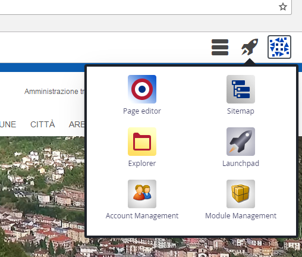
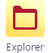
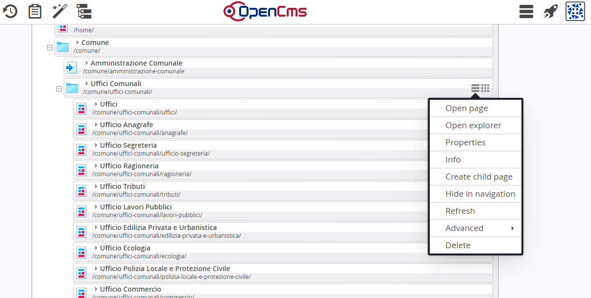
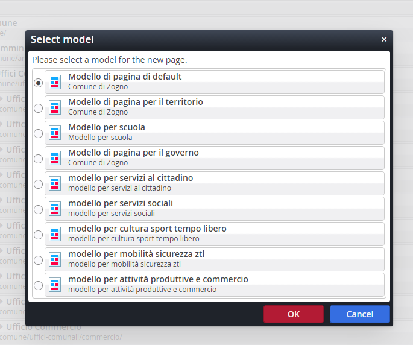
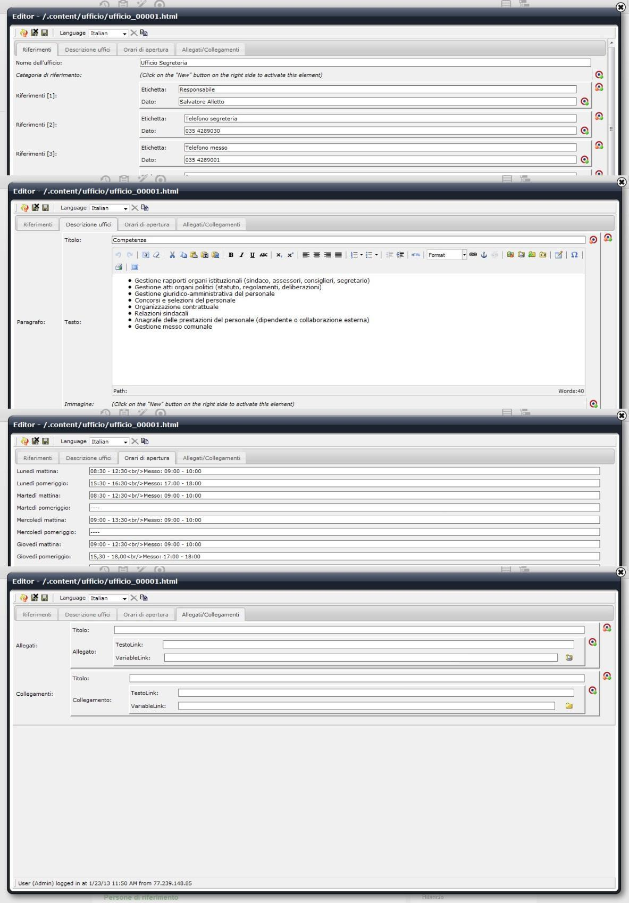

Creazione pagine vuote per uffici, servizi, pagine generiche (container page)
*****************************************************************************

Partendo dal portale in modalità Offline rispetto al progetto, in alto a destra nel browser cliccando sul simbolo della  \ |STYLE149|\  compaiono i sottostanti pulsanti.

\ |IMG53|\ 

+-----------+----------------------------------------------------------------------------------+
|\ |IMG54|\ |Tasto che permette di accedere alla mappa del portale per creare le container page|
+-----------+----------------------------------------------------------------------------------+
|\ |IMG55|\ |Tasto che apre il sito in Explorer                                                |
|           |                                                                                  |
+-----------+----------------------------------------------------------------------------------+
|\ |IMG56|\ |Tasto che apre il sito in modalità gestione utente                                |
|           |                                                                                  |
+-----------+----------------------------------------------------------------------------------+
|\ |IMG57|\ |Tasto Navicella che apre la visione di insieme dei tasti di gestione              |
+-----------+----------------------------------------------------------------------------------+

Il pulsante  \ |IMG58|\   permette di accedere alla \ |STYLE150|\ . 

\ |STYLE151|\  

\ |IMG59|\ 

Come mostra  la figura soprastante, in corrispondenza della cartella in cui si vuole creare la pagina, cliccare sul pulsante  \ |IMG60|\  “mostra menu”,  che elenca tutte le attività che si possono effettuare dalle singole pagine.

Cliccando sulla voce \ |STYLE152|\  (\ |STYLE153|\ ) è possibile, come nell’esempio, aggiungere una pagina in Uffici Comunali.

Compare la maschera di \ |STYLE154|\  come sotto rappresentata:

\ |IMG61|\ 

Ogni \ |STYLE155|\  contiene un corredo informativo e grafico particolare, per es. menu personalizzati, colori, multibox eccetera. 

Selezionando uno dei modelli soprastanti (Territorio, Governo, Servizi Sociali, ecc.) la nuova pagina rispetterà automaticamente le caratteristiche strutturali e grafiche di quel particolare modello .

Per es. si si vuole creare una servizio, un ufficio o una pagina che ha a che fare con il mondo scolastico, si selezionerà il \ |STYLE156|\ 

A questo punto nella mappa del portale comparirà la nuova pagina aggiunta, ancora con titolo indefinito “Page”. Si può modificare il titolo che diventa, nell’esempio, “Ufficio di base”.

La posizione della pagina nella mappa, rispecchia la posizione della pagina nel menu contestuale del portale pubblico. Se si desidera collocarla in altra posizione, si può spostare l’oggetto tenendo premuto sul pulsante  \ |IMG62|\  e trascinandolo nella posizione preferita.

Per proseguire con l’attività,  cliccare sul tasto Mostra menu\ |IMG63|\ e selezionare la funzione \ |STYLE157|\  (\ |STYLE158|\ ) 

Al momento, con l’attività appena descritta, di fatto è stato creato esclusivamente \ |STYLE159|\  che si sta costruendo ovvero  un link che comparirà nel menu contestuale e che porta a una pagina vuota.

in cui andranno inseriti i contenuti. 

\ |IMG64|\ 

.. |STYLE149| replace:: **navicella**

.. |STYLE150| replace:: **mappa del portale**

.. |STYLE151| replace:: **È in questa sezione che si creano le pagine cosiddette “container” che ospiteranno  (in seguito) il contenuto specifico.  Si  tratta di  involucri,  vuoti di contenuti, che corrispondono a voci di menu.**

.. |STYLE152| replace:: **Crea sotto-pagina**

.. |STYLE153| replace:: *Create child page*

.. |STYLE154| replace:: **selezione modello**

.. |STYLE155| replace:: **modello**

.. |STYLE156| replace:: **Modello per scuola.**

.. |STYLE157| replace:: **Mostra pagina**

.. |STYLE158| replace:: *Open in page editor*

.. |STYLE159| replace:: **l’involucro della pagina**

