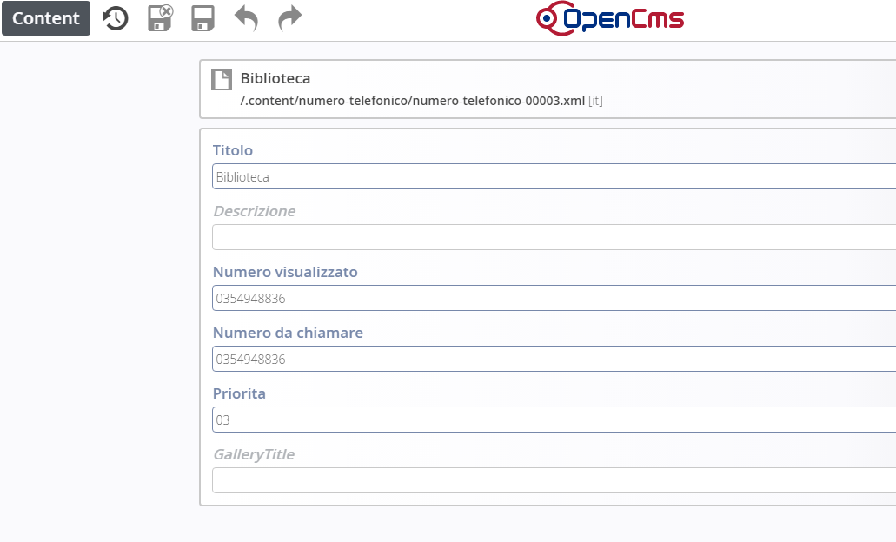

Gestione app
************

\ |IMG26|\ 

Dalla voce di menu \ |STYLE114|\   (non visibile online),  è possibile gestire  Numeri telefonici e Notifiche per l’applicazione per i cellulari.

Numeri telefonici
=================

Posizionarsi in Gestione e cliccare su Numeri telefonici

Per creare un nuovo numero telefonico, procedere in questo modo:

   * sfiorare con il mouse il simbolo del mirino 

   * cliccare sul simbolo \ |STYLE115|\   \ |STYLE116|\  

#. Per \ |STYLE117|\  un numero già esistente, cliccare sul simbolo della \ |STYLE118|\  

#. Per \ |STYLE119|\  un numero, cliccare sul simbolo del \ |STYLE120|\ 

Una volta aperto il dettaglio della pagina, procedere alla compilazione .

\ |IMG27|\ 

Una volta salvata la pagina e pubblicata, potrà essere visibile sull’applicazione dello smartphone nel modo seguente

\ |IMG28|\ 

Notifiche
=========

Per le notifiche, procedere come per i numeri telefonici.

La maschera di compilazione dal sito è la seguente. 

\ |IMG29|\  

Una volta salvata la pagina e pubblicata, potrà essere visibile sull’applicazione dello smartphone nel modo seguente

\ |IMG30|\ 

.. |STYLE114| replace:: **GESTIONE**

.. |STYLE115| replace:: **“più”**

.. |STYLE116| replace:: **+**

.. |STYLE117| replace:: **modificare**

.. |STYLE118| replace:: **matita**

.. |STYLE119| replace:: **eliminare**

.. |STYLE120| replace:: **cestino**

.. |IMG26| image:: immagini/Manuale_utente_sitoweb_10_5_7_25.png
   :height: 216 px
   :width: 561 px

.. |IMG28| image:: immagini/Manuale_utente_sitoweb_10_5_7_27.png
   :height: 413 px
   :width: 232 px

.. |IMG29| image:: immagini/Manuale_utente_sitoweb_10_5_7_28.png
   :height: 376 px
   :width: 641 px

.. |IMG30| image:: immagini/Manuale_utente_sitoweb_10_5_7_29.png
   :height: 542 px
   :width: 304 px
