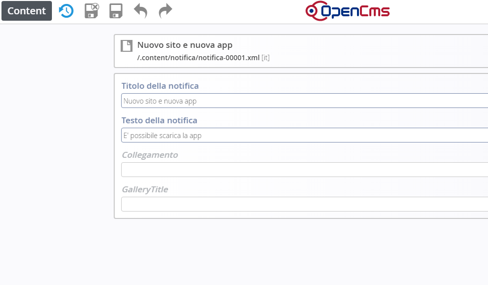

Notifiche
=========

Per le notifiche, procedere come per i numeri telefonici.

La maschera di compilazione dal sito è la seguente. 

\ |IMG29|\  

Una volta salvata la pagina e pubblicata, potrà essere visibile sull’applicazione dello smartphone nel modo seguente

\ |IMG30|\ 

.. |IMG30| image:: immagini/Manuale_utente_sitoweb_10_5_7_29.png
   :height: 542 px
   :width: 304 px
