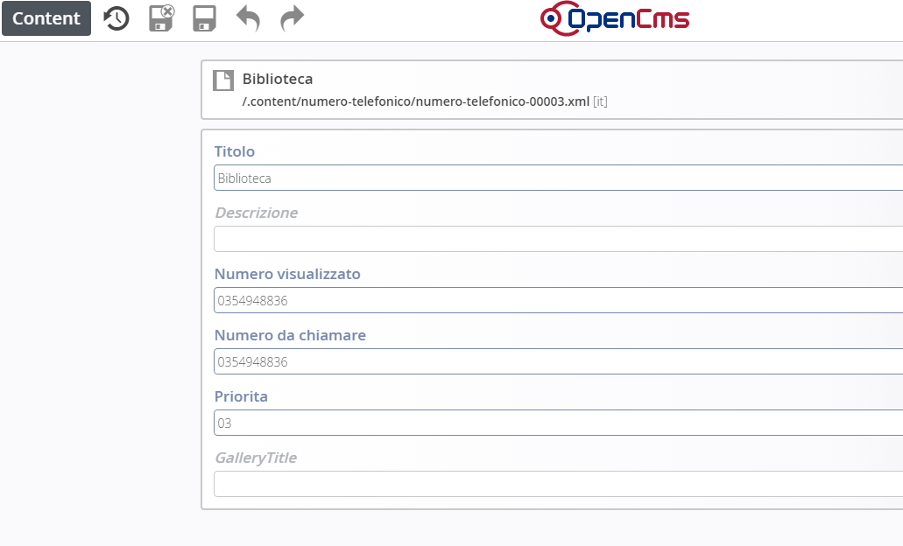

Numeri telefonici
=================

Posizionarsi in Gestione e cliccare su Numeri telefonici

Per creare un nuovo numero telefonico, procedere in questo modo:

* sfiorare con il mouse il simbolo del mirino 

* cliccare sul simbolo \ |STYLE115|\   \ |STYLE116|\  

#. Per \ |STYLE117|\  un numero già esistente, cliccare sul simbolo della \ |STYLE118|\  

#. Per \ |STYLE119|\  un numero, cliccare sul simbolo del \ |STYLE120|\ 

Una volta aperto il dettaglio della pagina, procedere alla compilazione .

\ |IMG27|\ 

Una volta salvata la pagina e pubblicata, potrà essere visibile sull’applicazione dello smartphone nel modo seguente

\ |IMG28|\ 

.. |STYLE115| replace:: **“più”**

.. |STYLE116| replace:: **+**

.. |STYLE117| replace:: **modificare**

.. |STYLE118| replace:: **matita**

.. |STYLE119| replace:: **eliminare**

