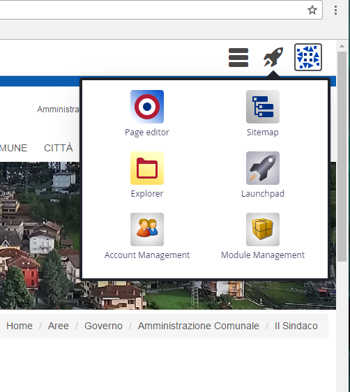
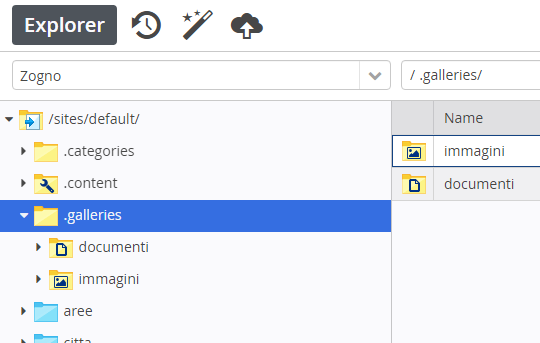
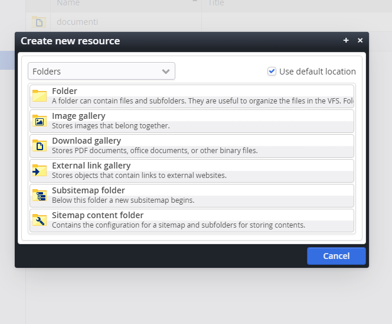

Gestione cartelle documenti/immagini in area di lavoro – Explorer
*****************************************************************

Accedere ad  Explorer dopo aver cliccato sulla Navicella 

\ |IMG31|\ 

\ |STYLE121|\ 

In Explorer, nella cartella \ |STYLE122|\   si trovano:  la cartella \ |STYLE123|\  per le foto e la cartella \ |STYLE124|\  per i moduli, documenti vari\ |STYLE125|\  

\ |IMG32|\ 

Dalla \ |STYLE126|\  “Create new  resource”, selezionare “Folders” e fare doppio click sulla cartella desiderata: Image gallery per le immagini , Download gallery per i documenti.

In seguito verrà chiesto di inserire il nome e il titolo della nuova galleria.

\ |IMG33|\ 

.. toctree::
    :maxdepth: 5
    suddivisione delle cartelle documenti e immagini.rst
    caricamento documenti e immagini.rst
    

.. |STYLE121| replace:: **Fin dall’inizio della gestione del sito, è buona norma effettuare una corretta archiviazione per avere ordine all’interno del File Manager e poter ritrovare facilmente file e cartelle che interessano.**

.. |STYLE122| replace:: **.galleries**

.. |STYLE123| replace:: **immagini**

.. |STYLE124| replace:: **documenti**

.. |STYLE125| replace:: **.**

.. |STYLE126| replace:: **bacchetta magica**

