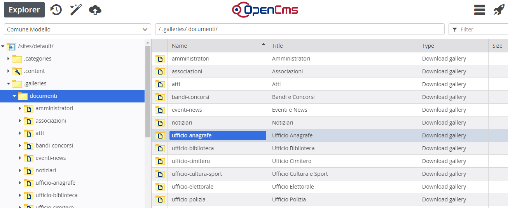

Suddivisione delle cartelle documenti e immagini
================================================

Per facilitare all’utente la gestione delle gallery, sono state create preventivamente   Cartelle documenti e Cartelle immagini seguendo  la seguente logica:

* per uffici (ufficio anagrafe, ufficio commercio, ufficio ragioneria ecc.)

* per tipo di contenuto (amministratori, associazioni, bandi, ecc )

    N.B. Questa suddivisione non vale per l’Amministrazione Trasparente

+-----------------------+-----------------------+
|\ |STYLE127|\          |                       |
+-----------------------+-----------------------+
|\ |STYLE128|\          |\ |STYLE129|\          |
+-----------------------+-----------------------+
|ufficio-anagrafe       |Ufficio Anagrafe       |
+-----------------------+-----------------------+
|ufficio-biblioteca     |Ufficio Biblioteca     |
+-----------------------+-----------------------+
|ufficio-cimitero       |Ufficio Cimitero       |
+-----------------------+-----------------------+
|ufficio-commercio      |Ufficio Commercio      |
+-----------------------+-----------------------+
|ufficio-cultura-sport  |Ufficio Cultura e Sport|
+-----------------------+-----------------------+
|ufficio-elettorale     |Ufficio Elettorale     |
+-----------------------+-----------------------+
|ufficio-ragioneria     |Ufficio Ragioneria     |
+-----------------------+-----------------------+
|ufficio-scuola         |Ufficio Scuola         |
+-----------------------+-----------------------+
|ufficio-segreteria     |Ufficio Segreteria     |
+-----------------------+-----------------------+
|ufficio-servizi-sociali|Ufficio Servizi Sociali|
+-----------------------+-----------------------+
|ufficio-stato-civile   |Ufficio Stato Civile   |
+-----------------------+-----------------------+
|ufficio-tributi        |Ufficio Tributi        |
+-----------------------+-----------------------+
|ufficio-tecnico        |Ufficio Tecnico        |
+-----------------------+-----------------------+
|ufficio-polizia        |Ufficio Polizia        |
+-----------------------+-----------------------+
|ufficio-protocollo     |Ufficio Protocollo     |
+-----------------------+-----------------------+
|ufficio-territorio     |Ufficio Territorio     |
+-----------------------+-----------------------+
|ufficio-urp            |Ufficio URP            |
+-----------------------+-----------------------+
|\ |STYLE130|\          |                       |
+-----------------------+-----------------------+
|amministratori         |Amministratori         |
+-----------------------+-----------------------+
|associazioni           |Associazioni           |
+-----------------------+-----------------------+
|atti                   |Atti                   |
+-----------------------+-----------------------+
|bandi-concorsi         |Bandi e Concorsi       |
+-----------------------+-----------------------+
|eventi-news            |Eventi e News          |
+-----------------------+-----------------------+
|notiziari              |Notiziari              |
+-----------------------+-----------------------+
|\ |STYLE131|\          |                       |
+-----------------------+-----------------------+
|\ |STYLE132|\          |\ |STYLE133|\          |
+-----------------------+-----------------------+
|uffici                 |Uffici                 |
+-----------------------+-----------------------+
|amministratori         |Amministratori         |
+-----------------------+-----------------------+
|associazioni           |Associazioni           |
+-----------------------+-----------------------+
|loghi-banner           |Loghi e Banner         |
+-----------------------+-----------------------+
|eventi-news            |Eventi e News          |
+-----------------------+-----------------------+
|header                 |Header                 |
+-----------------------+-----------------------+
|gallerie-fotografiche  |Gallerie Fotografiche  |
+-----------------------+-----------------------+
|immagini-homepage      |Immagini Homepage      |
+-----------------------+-----------------------+
|territorio             |Territorio             |
+-----------------------+-----------------------+

Questa suddivisione può essere ovviamente modificata a piacimento secondo le esigenze del Comune.

La modalità di scrittura del nome e titolo delle cartelle, ha una sua importanza nell’archivio, per una questione di ordine e funzionalità.

In Explorer, per ogni cartella, \ |STYLE134|\  va scritto in sole lettere minuscole con eventuale trattino come separatore (-), (tipo url) – il \ |STYLE135|\  va scritto con la sola prima lettera maiuscola di ogni parola

\ |IMG34|\ 

.. |STYLE127| replace:: **CARTELLE DOCUMENTI PER UFFICI**

.. |STYLE128| replace:: **NAME (Nome)**

.. |STYLE129| replace:: **TITLE (Titolo)**

.. |STYLE130| replace:: **CARTELLE DOCUMENTI PER CONTENUTO**

.. |STYLE131| replace:: **CARTELLE IMMAGINI**

.. |STYLE132| replace:: **NAME (nome)**

.. |STYLE133| replace:: **TITLE (titolo)**

.. |STYLE134| replace:: **Name**

