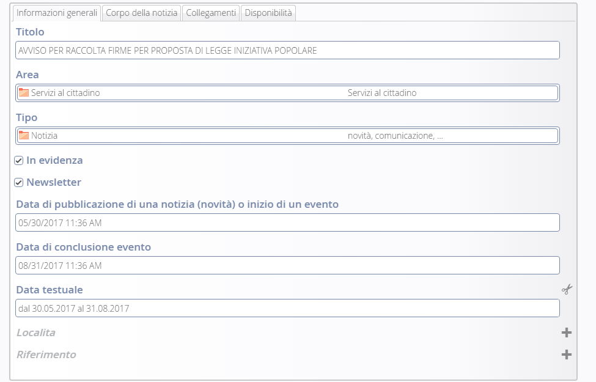
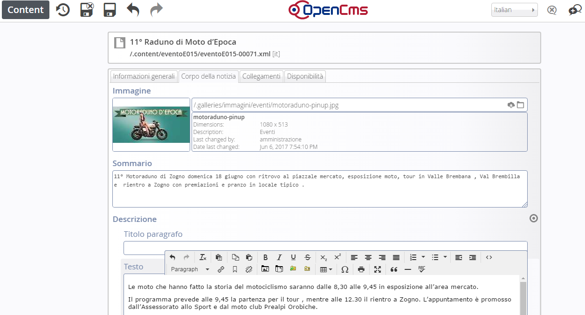
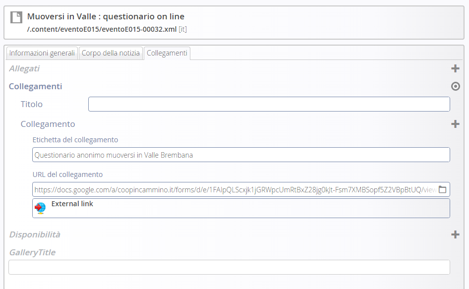

Gestione News
*************

Inserimento/modifica delle news:
================================

Posizionarsi nella sezione del sito di news ed eventi

Per creare una nuova pagina es. notizia, procedere in questo modo:

   * sfiorare con il mouse il simbolo del mirino 

   * cliccare sul simbolo \ |STYLE85|\   \ |STYLE86|\  

#. Per \ |STYLE87|\  una notizia già esistente, cliccare sul simbolo della \ |STYLE88|\  

#. Per \ |STYLE89|\  una notizia, cliccare sul simbolo del \ |STYLE90|\ 

Una volta aperto il dettaglio della novità, per eseguire la modifica o un nuovo inserimento, vengono visualizzati una serie di tab che corrispondono ai vari gruppi di informazioni che costituiscono la novità.

I tasti nella parta alta permettono di salvare le modifiche, pubblicarle direttamente o annullarle.

A questo punto si procede con la compilazione dei contenuti veri e propri della notizia.

Informazioni generali
=====================

\ |IMG23|\ 

Si tratta d’informazioni descrittive che compaiono nel dettaglio della news.

\ |STYLE91|\  è il titolo della notizia

La voce \ |STYLE92|\  permette, se richiesto, di legare la novità ad un argomento attraverso la definizione di una “chiave” comune tra gli oggetti.

La voce \ |STYLE93|\  permette, di definire il tipo di news: Notizia – Evento –Primo piano

\ |STYLE94|\  la notizia appare \ |STYLE95|\  nella sezione centrale in home page

\ |STYLE96|\  attiva l’invio di una newsletter

\ |STYLE97|\   E’ la data di inizio evento e  costituisce il criterio in base al quale Notizie ed Eventi vengono “ordinati” per essere visualizzati sul sito.

Il comportamento dei 2 tipi di news segue criteri di priorità differenti :

* gli \ |STYLE98|\  vengono ordinati nel modo seguente : \ |STYLE99|\  (da oggi in poi). Gli eventi  vecchi non vengono più visualizzati

* le \ |STYLE100|\  vengono ordinate secondo l’ordine di pubblicazione: \ |STYLE101|\ . Questo comportamento può essere modificato intervenendo sulla data di pubblicazione di una notizia

Nell’elenco a destra in home page,  vengono visualizzati solo alcune Notizie e alcuni Eventi. Se c’è l’esigenza di far comparire una news specifica, bisognerà “giocare” sulla Data di pubblicazione, modificando le altre.

\ |STYLE102|\  : non visualizza più evento e notizia da quella data in poi, dalla home page e dalla pagina principale di lista eventi e notizie e rimane in archivio

\ |STYLE103|\  E’ possibile inserire una data descrittiva (Es: “L’ultima domenica del mese”)

Corpo della notizia
===================

\ |IMG24|\ 

\ |STYLE104|\  – In homepage i primi piani e gli eventi hanno associato un’immagine che va definita in questa sezione.

L’immagine deve essere caricata nel progetto e quindi richiamata all’interno di questo documento strutturato. Non è strettamente necessario caricare un’immagine delle esatte dimensioni utili: il programma effettua una attività di ridimensionamento. E’ comunque opportuno caricare un’immagine non troppo grande e di forma quadrata o rettangolare/panoramica (più lunga di base che di altezza).

\ |STYLE105|\  \ |STYLE106|\ \ |STYLE107|\ 

\ |STYLE108|\  – Questa nota testuale unitamente al titolo compare sia in homepage (solo per i primi piani) che nella pagina di elenco delle novità.

\ |STYLE109|\ 

Costituisce il cuore della notizia. 
Qui viene messo il titolo, il testo e un immagine che vengono mostrati nel dettaglio.

Il paragrafo è una sorta di blocco che può essere ripetuto più volte selezionando il +

L’immagine può essere preventivamente caricata oppure caricata al momento.

Per l’immagine può  essere definita la posizione rispetto al testo e l’eventuale didascalia: sopra, sotto, destra e sinistra.

Collegamenti
============

\ |IMG25|\ 

\ |STYLE110|\  Qui è possibile integrare ogni singolo allegato da associare alla pagina così pure i collegamenti.

\ |STYLE111|\  – \ |STYLE112|\  insieme alla \ |STYLE113|\  definiscono  l’inizio e la fine della “visibilità” della notizia, al di fuori di quest’intervallo la notizia “scompare” dal portale, anche se esiste ancora in Explorer sotto /.content/..

Se non viene specificata una data in disponibilità , la notizia/evento viene resa visibile agli utenti all'istante perché prende come default la data e ora odierna.

Se è necessario che una notizia/evento sia visualizzabile agli utenti solo dopo una certa data è possibile usare il campo disponibilità (data e ora rilascio).

.. |STYLE85| replace:: **“più”**

.. |STYLE86| replace:: **+**

.. |STYLE87| replace:: **modificare**

.. |STYLE88| replace:: **matita**

.. |STYLE89| replace:: **eliminare**

.. |STYLE90| replace:: **cestino**

.. |STYLE91| replace:: **Titolo :**

.. |STYLE92| replace:: **Area**

.. |STYLE93| replace:: **Tipo**

.. |STYLE94| replace:: **In evidenza:**

.. |STYLE95| replace:: **in primo piano**

.. |STYLE96| replace:: **Newsletter:**

.. |STYLE97| replace:: **Data di pubblicazione di una notizia (novità) o inizio di un evento:**

.. |STYLE98| replace:: **Eventi  e i Primi Piani**

.. |STYLE99| replace:: **dal più vicino al più lontano**

.. |STYLE100| replace:: **Notizie**

.. |STYLE101| replace:: **l’ultima pubblicata compare in prima posizione**

.. |STYLE102| replace:: **Data di conclusione**

.. |STYLE103| replace:: **Data testuale:**

.. |STYLE104| replace:: **Immagine**

.. |STYLE105| replace:: *(approfondisci al capitolo:*

.. |STYLE106| replace:: **Caricamento documenti/immagini**

.. |STYLE107| replace:: *)*

.. |STYLE108| replace:: **Sommario**

.. |STYLE109| replace:: **Paragrafo**

.. |STYLE110| replace:: **Allegati/collegamenti :**

.. |STYLE111| replace:: **Disponibilità**

.. |STYLE112| replace:: **Data e ora rilascio**

.. |STYLE113| replace:: **Data e ora scadenza**

