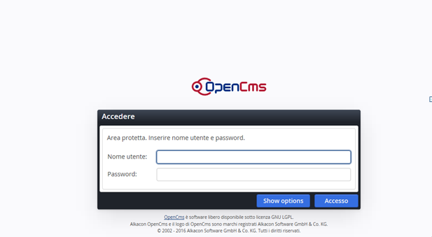
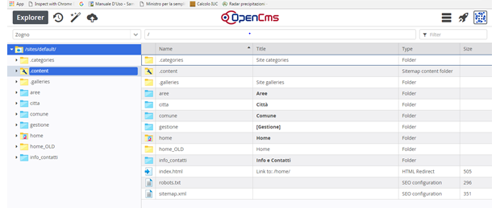
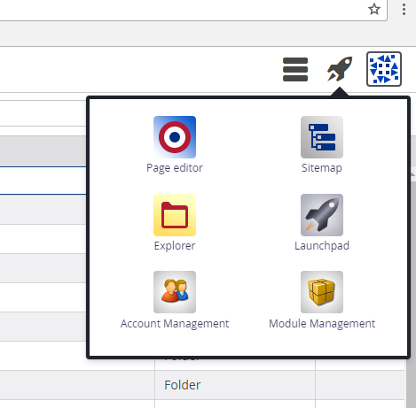
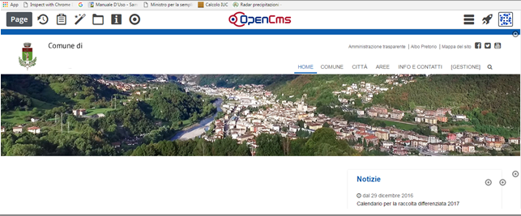

Gestione di base del progetto
*****************************

Accesso
=======

Per collegarsi al progetto opencms, digitare nella barra degli indirizzi del browser il seguente percorso: 

\ |LINK1|\  

\ |IMG2|\ 

Dopo aver inserito le proprie credenziali nella finestra di accesso,  il sito del Comune apparirà in modalità area di lavoro o (workplace).

\ |IMG3|\ 

L’area di lavoro ricorda \ |STYLE2|\ di Windows perché tutte le voci di menu presenti nel sito vengono qui visualizzate sotto forma di cartelle e file.

Dall’area di lavoro  Explorer, per passare alla visualizzazione del sito in modalità offline, cliccare sul simbolo della \ |STYLE2|\   sul menu in alto a destra e accedere dal  \ |STYLE3|\  in \ |STYLE4|\ 

\ |IMG4|\ 

A questo punto ci si trova  in Page editor ovvero l’area di gestione del sito: 

\ |IMG5|\ 

Si noterà subito, sotto al banner, la presenza di mirini, che sono i simboli di gestione caratteristici di Opencms 

Il \ |STYLE5|\   identifica la possibilità di editare una qualsiasi sezione nel sito, altrimenti  in mancanza di questo, per eventuali modifiche, bisogna rivolgersi allo sviluppatore.

