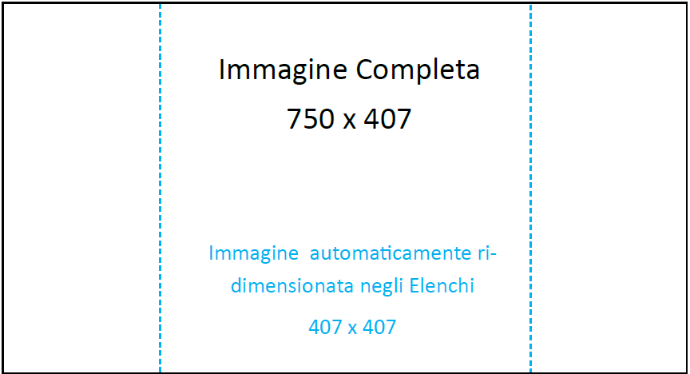
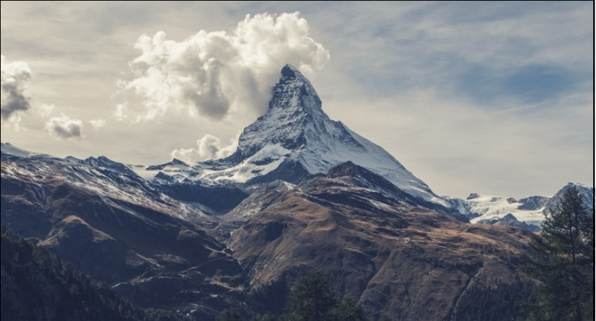
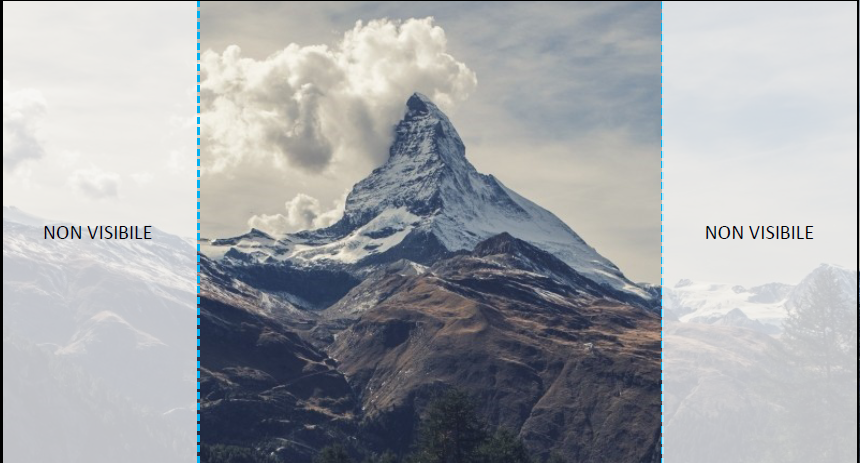
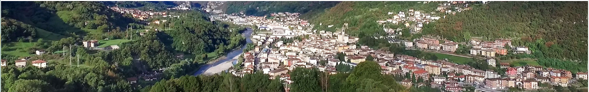
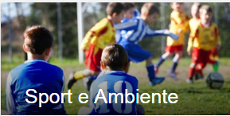
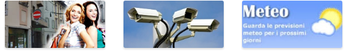

Immagini per notizie ed eventi
==============================

Le immagini che vanno caricate nel sito per \ |STYLE143|\ , devono avere una dimensione ottimale di 750\*407  (anche 400)

L’ immagine viene poi  “ritagliata” dal sistema in maniera centrata in funzione della visualizzazione(sul sito o sulla app). Ne consegue che bisogna “calcolare” che il dettaglio migliore, sia nella parte centrale.

In allegato un esempio di come deve essere un'immagine nei primi piani e il ritaglio che viene effettuato dal sistema nel caso di liste

\ |IMG47|\ 

\ |IMG48|\ 

\ |IMG49|\ 

Le immagini panoramiche
-----------------------

Le immagini \ |STYLE144|\  che vanno caricate nel sito per \ |STYLE145|\  , devono avere una dimensione ottimale 1622\*390  

Generalmente  ne serve minimo una, ma se si vuole si può abbinare una foto panoramica specifica per ogni sezione del sito, e in tal caso, servirebbe una foto per ogni sezione.  

Inoltre per la \ |STYLE146|\  sono  necessarie nr.1 immagine verticale e 1 orizzontale

\ |IMG50|\ 

Le immagini per le aree
-----------------------

Le immagini delle \ |STYLE147|\  (9 aree in home page: Amministrazione, Servizi al cittadino, Politiche sociali, ecc) devono essere tutte della stessa dimensione e della maggior risoluzione possibile.

Qui sotto l’esempio di un’immagine dell’area Sport e Ambiente.

\ |IMG51|\ 

Le immagini dei banner
----------------------

Le immagini dei banner che si trovano nel footer  in fondo alla homepage, devono avere la dimensione standard di 310\*180.

\ |IMG52|\ 

Logo ufficiale del Comune
-------------------------

Il Logo ufficiale del Comune deve essere fornito ad alta risoluzione.

.. |STYLE143| replace:: **notizie ed eventi**

.. |STYLE144| replace:: **panoramiche**

.. |STYLE145| replace:: **la testata**

.. |STYLE146| replace:: **app**

.. |STYLE147| replace:: **aree**

