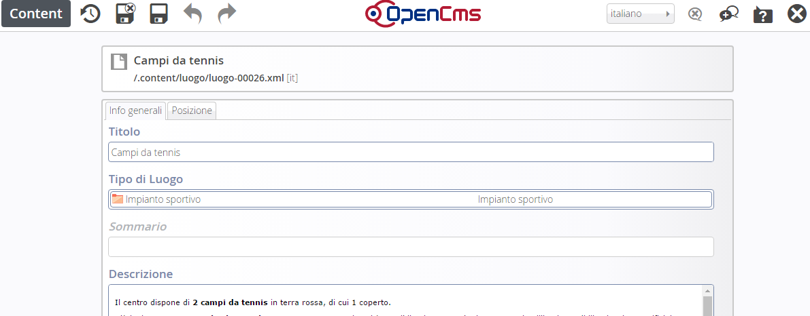
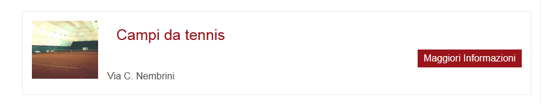
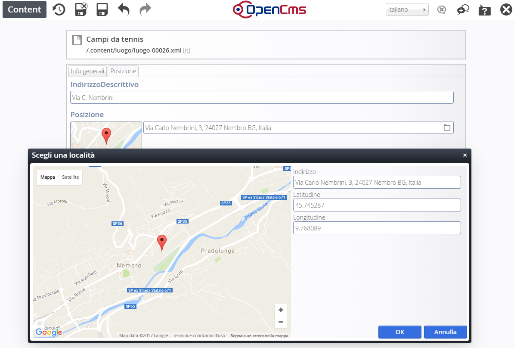

Creazione Luoghi
================

Inserimento /modifica di un Luogo
---------------------------------

Per creare un nuovo Luogo, procedere in questo modo:

* sfiorare con il mouse il simbolo del mirino

* cliccare sul simbolo \ |STYLE43|\   \ |STYLE44|\  

Per \ |STYLE45|\  un luogo già esistente, cliccare sul simbolo della \ |STYLE46|\  

Per \ |STYLE47|\  un luogo, cliccare sul simbolo del \ |STYLE48|\ 

A questo punto si procede con la compilazione dei contenuti veri e propri.

Info generali
-------------

\ |IMG15|\ \ |STYLE49|\   

(ad esempio:  Campo da tennis)

\ |STYLE50|\  

(settare il tipo dalla lista dei luoghi: Impianto sportivo, Biblioteca, Chiesa, Cinema/Teatro, Edificio, Farmacia, ecc )

\ |STYLE51|\  

Breve descrizione che si visualizza nella lista

\ |STYLE52|\  

Inserire la descrizione dettagliata del luogo per es.: 

“Il centro  dispone di \ |STYLE53|\  in terra rossa, di cui 1 coperto. C'è inoltre un \ |STYLE54|\ , coperto, in cui è possibile giocare anche la sera grazie all'impianto di illuminazione artificiale. Gli spogliatoi sono tre (escluso quello per l'arbitro), luminosi e spaziosi.”

\ |STYLE55|\  

Inserire un numero (1,2,3) in caso si voglia dare un ordine di priorità nella lista della pagina

\ |STYLE56|\  

L’immagine deve essere caricata nel progetto e quindi richiamata all’interno di questo documento strutturato. Non è strettamente necessario caricare un’immagine delle esatte dimensioni utili: il programma effettua una attività di ridimensionamento. E’ comunque opportuno caricare un’immagine non troppo grande e di forma quadrata o rettangolare/panoramica (più lunga di base che di altezza).

Posizione
---------

\ |STYLE57|\   

(ad esempio:  via C. Nembrini) Quanto scritto sarà visibile nella pagina principale

\ |IMG16|\ 

\ |STYLE58|\  

Cliccando sul simbolo della cartella a destra si visualizza una mappa:

\ |IMG17|\ 

Digitando l’indirizzo, verranno visualizzati  in automatico dei suggerimenti per aiutare nella compilazion. Una volta scelto l’indirizzo verranno visualizzate latitudine e longitudine

\ |STYLE59|\ 

In questa sezione possono essere aggiunti  il Nome del Contatto  e tutti i riferimenti che si vogliono evidenziare (indirizzo, E-mail, telefono).

I riferimenti sono modulari: lo strumento permette di aggiungere, togliere, modificare, spostare di ordine ogni singolo riferimento composto di una Etichetta e di un dato.

Es. Telefono (etichetta) 035 333333 (dato)

\ |STYLE60|\ 

.. |STYLE43| replace:: **“più”**

.. |STYLE44| replace:: **+**

.. |STYLE45| replace:: **modificare**

.. |STYLE46| replace:: **matita**

.. |STYLE47| replace:: **eliminare**

.. |STYLE48| replace:: **cestino**

.. |STYLE49| replace:: **Titolo**

.. |STYLE50| replace:: **Tipo di luogo**

.. |STYLE51| replace:: **Sommario**

.. |STYLE52| replace:: **Descrizione**

.. |STYLE53| replace:: **2 campi da tennis**

.. |STYLE54| replace:: **campo polivalente calcetto-tennis**

.. |STYLE55| replace:: **Priorità**

.. |STYLE56| replace:: **Immagine**

.. |STYLE57| replace:: **Indirizzo descrittivo**

.. |STYLE58| replace:: **Pozizione**

.. |STYLE59| replace:: **Contatto**

.. |STYLE60| replace:: **Gallery title non va compilato**

