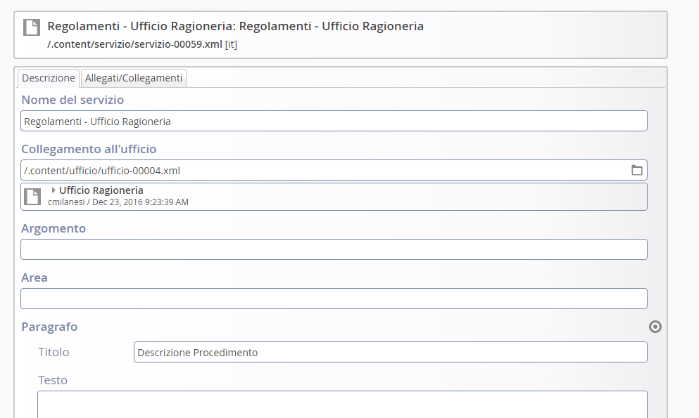

Il servizio, come l’ufficio, è un documento strutturato composto di diversi segmenti.

\ |IMG12|\ 

In “Descrizione” ci sono  i seguenti campi:

\ |STYLE33|\  in cui viene indicato il nome del servizio

\ |STYLE34|\  che permette di introdurre un link che permetta di andare verso l’Ufficio indicato.

\ |STYLE35|\  permettono  di legare il servizio ad un argomento/sezione attraverso la definizione di una “chiave” comune tra gli oggetti.

\ |STYLE36|\  Questo segmento ripropone esattamente quanto visto per l’ufficio. Qui è possibile integrare ogni singolo allegato da associare alla pagina così pure i collegamenti.

   
   
.. |STYLE33| replace:: **Nome del servizio**

.. |STYLE34| replace:: **Collegamento all’ufficio**

.. |STYLE35| replace:: **Argomento  e Area**

.. |STYLE36| replace:: **Allegati/collegamenti :**
