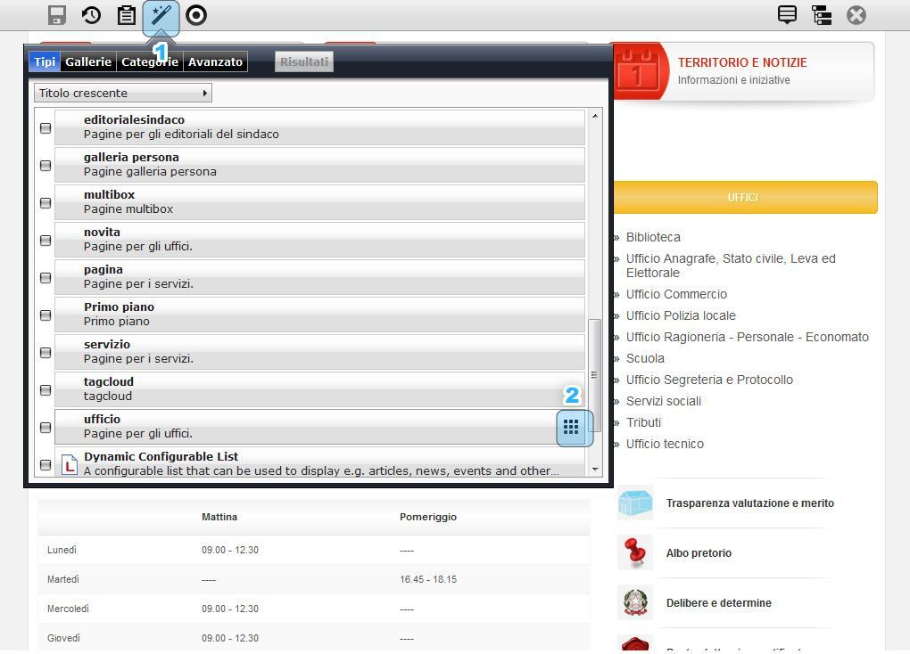
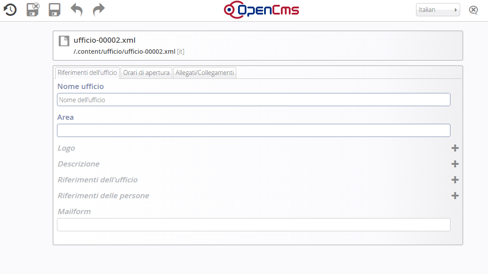

Creazione pagina ufficio
========================

Se si vuole aggiungere al portale un nuovo ufficio bisogna creare una pagina strutturata di tipo Ufficio

Per aggiungere una pagina ufficio si deve:

* cliccare sul pulsante “Crea pagina” (evidenza 1) tasto “Bacchetta magica”

* tra i vari oggetti presenti, scegliere quello desiderato

* trascinare l’oggetto desiderato all’interno della pagina vuota (\ |STYLE27|\ )

\ |IMG10|\ 

Il \ |STYLE28|\  dell’oggetto: \ |STYLE29|\   e \ |STYLE30|\   va eseguito con attenzione nello spazio tratteggiato in rosso\ |STYLE31|\  Di seguito cliccare sul simbolo della matita e per ottenere lo scheletro di pagina sotto riportato:

\ |IMG11|\ 

In questo caso siamo di fronte a un \ |STYLE32|\  composto di diverse segmenti che andranno personalizzati in ogni sezione.

.. |STYLE27| replace:: **evidenza 2**

.. |STYLE28| replace:: **trascinamento**

.. |STYLE29| replace:: **Ufficio,**

.. |STYLE30| replace:: **il corretto posizionamento**

.. |STYLE31| replace:: **.**

.. |STYLE32| replace:: **modello**
