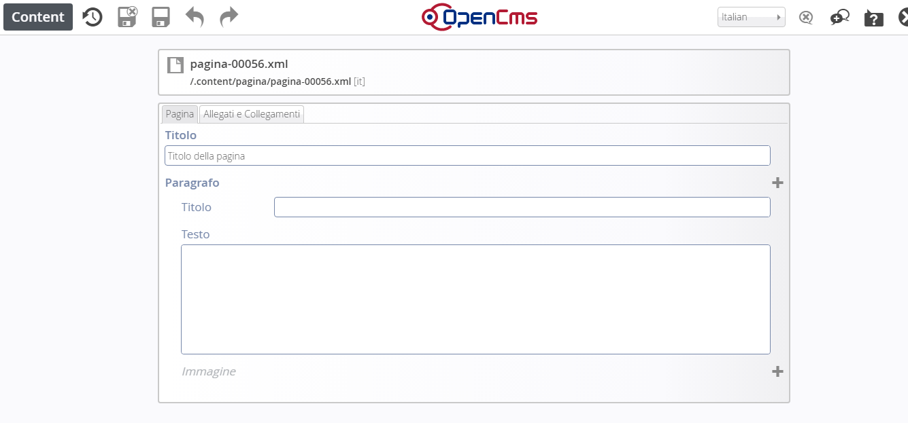

Creazione pagine ordinarie
==========================

Se si volesse aggiungere al portale del contenuto non che non sia né di tipo uffici né di tipo servizi, si dovrà  optare per una pagina di tipo ordinario.

Per aggiungere una pagina  ordinaria in un qualsiasi punto del sito si deve:

* cliccare sul pulsante “Crea pagina” (evidenza 1) tasto “Bacchetta magica”

* tra i vari oggetti presenti, scegliere quello desiderato

* trascinare l’oggetto desiderato all’interno della pagina vuota (\ |STYLE37|\ ) 

\ |IMG13|\ 

Il \ |STYLE38|\  dell’oggetto: \ |STYLE39|\   e \ |STYLE40|\   va eseguito con attenzione nello spazio tratteggiato in rosso\ |STYLE41|\  Di seguito cliccare sul simbolo della matita e per ottenere lo scheletro di pagina sotto riportato:

\ |IMG14|\ 

In questo caso siamo di fronte a un documento strutturato simile a quelli precedenti ma più semplice e con  meno sezioni.

.. |IMG13| image:: immagini/Manuale_utente_sitoweb_10_5_7_10.jpeg
   :height: 461 px
   :width: 641 px

   
.. |STYLE37| replace:: **evidenza 2**

.. |STYLE38| replace:: **trascinamento**

.. |STYLE39| replace:: **Pagina,**

.. |STYLE40| replace:: **il corretto posizionamento**

.. |STYLE41| replace:: **.**
