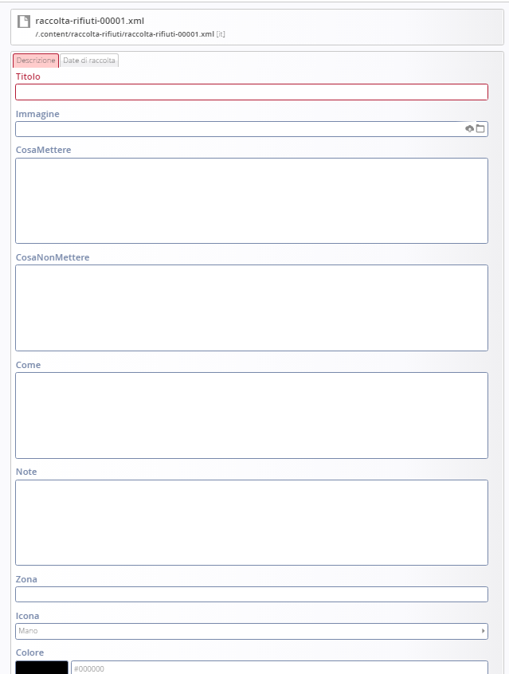
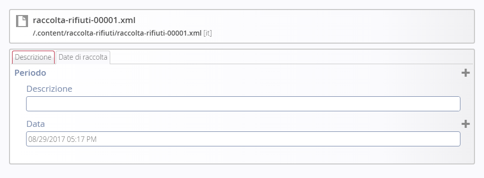
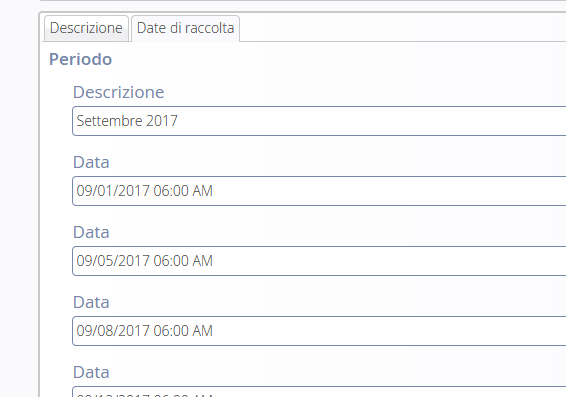

Creazione Rifiuti
=================

Inserimento /modifica di un Rifiuto
-----------------------------------

Per creare un nuovo Rifiuto, procedere in questo modo:

* sfiorare con il mouse il simbolo del mirino

* cliccare sul simbolo \ |STYLE62|\   \ |STYLE63|\  

Per \ |STYLE64|\  un rifiuto già esistente, cliccare sul simbolo della \ |STYLE65|\  

Per \ |STYLE66|\  un rifiuto, cliccare sul simbolo del \ |STYLE67|\ 

A questo punto si procede con la compilazione dei contenuti veri e propri.

Descrizione
-----------

\ |IMG18|\ 

\ |STYLE68|\   

indicare il tipo di rifiuto ad esempio:  Carta, vetro, lattine, umido)

\ |STYLE69|\  

scegliere  un’immagine o una foto sul tipo di rifiuto es. bidoni, cassonetti, tipo rifiuto particolare ecc )

\ |STYLE70|\  

Descrizione del rifiuto

\ |STYLE71|\  

Descrizione di cosa non va messo

\ |STYLE72|\ 

Modalità di raccolta, es. porta a porta, presso la piattaforma ecologica, piattaforma mobile 

Modalità temporali: es. tutti i venerdì oppure periodo invernale.

\ |STYLE73|\ 

* Per i comuni con una zona unica di raccolta, il campo va lasciato vuoto.

* Pe i comuni con più zone da selezionare, va preventivamente compilato l’oggetto “zona” entrando in Explorer, nella cartella : /.categories/zona-rifiuti/ dove si possono creare e gestire le cartelle coi nomi delle varie zone rifiuto (es. zona nord oppure  centro città, area industriale)

A questo punto dopo aver creato i vari oggetti “zona” è possibile selezionare  la zona della città  dal menu a tendina nell’editor di testo.

\ |STYLE74|\ 

Selezionare l’icona dall’elenco

\ |STYLE75|\ 

Selezionare il colore per l’icona che potrebbe essere lo stesso per i sacchi della raccolta.

Date di raccolta
----------------

\ |IMG19|\ 

\ |STYLE76|\  

Questo campo non è visualizzabile sull’app. serve solamente per gestire raggruppamenti  che si svolgono nell’arco di un periodo di tempo

\ |STYLE77|\  

\ |IMG20|\ 

Dove la valorizzazione del campo descrizione: “Settembre 2017” , serve solo per organizzare le date che verranno scritte di seguito.

Infatti se si vuole che sull’app compaiano date o orari particolari, vanno indicate nel campo: \ |STYLE78|\ 

\ |STYLE79|\ 

E’ la data futura della raccolta del rifiuto. Tale data permette la visualizzazione sul calendario rifiuti.

l' ora non vien visualizzata. 

N.B. Non esistono legami con le notifiche push

.. |STYLE62| replace:: **“più”**

.. |STYLE63| replace:: **+**

.. |STYLE64| replace:: **modificare**

.. |STYLE65| replace:: **matita**

.. |STYLE66| replace:: **eliminare**

.. |STYLE67| replace:: **cestino**

.. |STYLE68| replace:: **Titolo**

.. |STYLE69| replace:: **Immagine**

.. |STYLE70| replace:: **Cosa mettere**

.. |STYLE71| replace:: **Cosa non mettere**

.. |STYLE72| replace:: **Come**

.. |STYLE73| replace:: **Zona**

.. |STYLE74| replace:: **Icona**

.. |STYLE75| replace:: **Colore**

.. |STYLE76| replace:: **Descrizione**

.. |STYLE77| replace:: **Es.**

.. |STYLE78| replace:: **COME**

.. |STYLE79| replace:: **Data**

