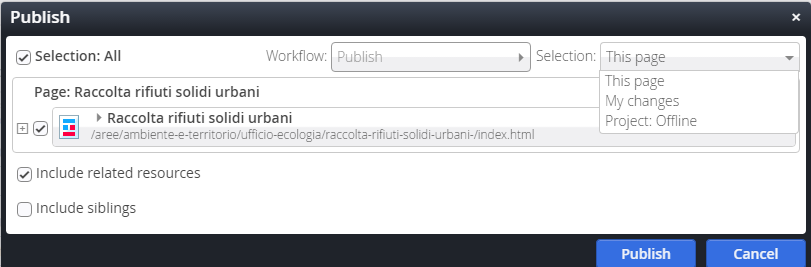

Pubblicazione
=============

L’attività di pubblicazione va fatta per poter visualizzare le \ |STYLE80|\  nel \ |STYLE81|\ .

Si raccomanda di lavorare sempre con \ |STYLE82|\  browser  differenti. Uno, in cui si effettuano le modifiche di  gestione e l’altro per controllare, a pubblicazione avvenuta, il buon esito della modifica effettuata.

\ |IMG21|\ 

Il simbolo dell’\ |STYLE83|\ , apre la finestra seguente:

\ |IMG22|\ 

Se viene selezionata la  pagina corrente, verranno pubblicate le modifiche fatte nella pagina in cui ci si trova. Altrimenti  si possono selezionare “le mie modifiche” oppure “tutto il progetto offline” e poi pubblicare.

Anche le singole attività da pubblicare possono essere selezionate, valorizzando la casella di controllo specifica.

Da Explorer, è possibile visualizzare cosa è stato pubblicato e cosa ancora è visibile solo offline.

\ |STYLE84|\  ricorda che il file deve essere ancora pubblicato e per essere visualizzato on line: tasto dx del mouse e pubblica direttamente.

In caso di pubblicazione errata, si può sempre ripristinare la versione precedente in questo modo: 

da Explorer, una volta identificato il file da ripristinare, tasto dx del mouse, cronologia, una finestra  consente il ripristino della versione precedente alla modifica fatta.

.. |STYLE80| replace:: **nuove creazioni, modifiche o eliminazioni**

.. |STYLE81| replace:: **progetto online**

.. |STYLE82| replace:: **due**

.. |STYLE83| replace:: **orologio**

.. |STYLE84| replace:: **La presenza di  un pallino rosso**

